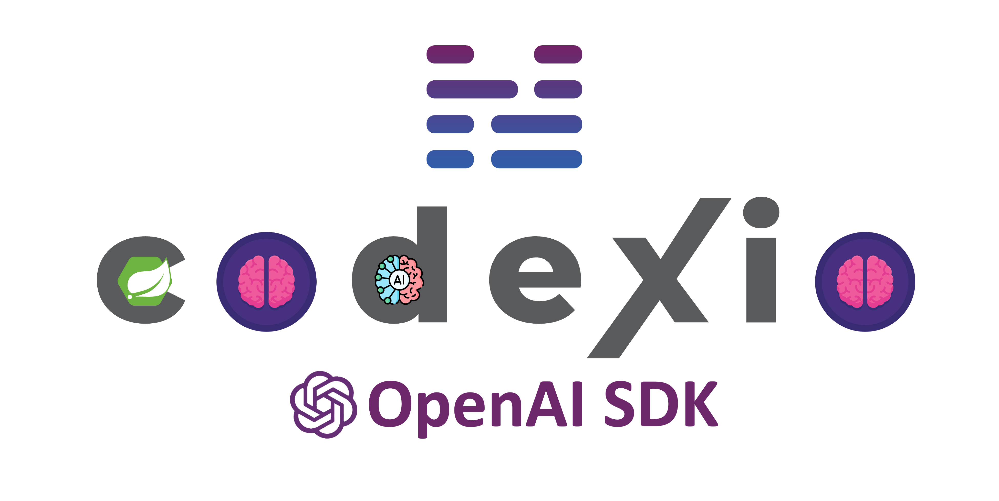

<h1 align="center">Spring Boot Starter for OpenAI SDK by Codexio</h1>

<p align="center">
    
    <br/>
    <em>
        Use artificial intelligence the intelligent way.
    </em>
</p>

<div align="center">

[](https://central.sonatype.com/artifact/bg.codexio.ai/openai-api-sdk)
[](https://github.com/CodexioLtd/spring-boot-starter-openai/actions/workflows/maven.yml)
[](https://github.com/CodexioLtd/spring-boot-starter-openai/blob/master/LICENSE)

</div>

## Preambule

The Spring  Boot starter
provides autoconfiguration for
the [OpenAI SDK by Codexio](https://github.com/CodexioLtd/openai-api-sdk),
which means you can inject meaningful beans into your Spring Boot project,
by just providing property configuration such as your `apiKey`.

## Table of Contents

* [Quick Start](#quick-start)
* [Prerequisite](#prerequisite)
* [Property Configuration](#property-configuration)
    * [Credentials](#credentials)
    * [Logging](#logging)
    * [HTTP](#http)
        * [Timeouts](#timeouts)
        * [Connection Pool](#connection-pool)
* [Autoconfigured Beans](#autoconfigured-beans)
    * [Chat](#chat)
    * [Images](#images)
    * [Vision](#vision)
    * [Voice](#voice)
* [JSON Auth Limitations](#json-auth-limitations)
* [Contributing](#contributing)
* [License](#license)

## Quick Start

1. First of all, make sure you have created an API Key from [here](https://platform.openai.com/api-keys).
2. Open your Spring Boot Project (or create one)
3. Add the library as a dependency in your project

```xml

<dependency>
    <groupId>bg.codexio.springframework.boot</groupId>
    <artifactId>spring-boot-starter-openai</artifactId>
    <version>0.8.0.BETA</version>
</dependency>
```

4. Configure API key:

    - `application.properties`:
   ```properties
    codexio.openai.api-key=YOUR_API_KEY_HERE
    ```
    - `application.yml`:
   ```yml
    codexio:
      openai:
        api-key: YOUR_API_KEY_HERE
    ```
5. Inject the `ChatApi` (or `Gpt35ChatApi`. `Gpt4ChatApi`, `ImagesApi`, `VisionApi`, `SpeechApi`,
   `TranscriptionApi`, `TranslationApi` ) bean to some of your services / controllers:

```java
@RestController
@RequestMapping("/conversations")
public class ChatController {

    private final GPT4ChatApi chatApi;

    public ChatController(GPT4ChatApi chatApi) {
        this.chatApi = chatApi;
    }

    @PostMapping
    public String chat(@RequestBody String prompt) {
        return this.chatApi.deterministic()
                           .andRespond()
                           .immediate()
                           .ask(prompt);
    }
}
```

6. Run your application

```spel
INFO 37908 --- [main] o.s.b.w.embedded.tomcat.TomcatWebServer  : Tomcat started on port 8080 (http) with context path ''
INFO 37908 --- [main] b.c.test.TestOpenAIStarter               : Started TestOpenAIStarterApp in 2.786 seconds (process running for 3.142)
```

7. Send Request and check the response :)

```shell
$ curl -d "How much is 2+2, elaborate" http://localhost:8080/conversations
2 + 2 equals 4.

This is a basic arithmetic operation where you are adding two numbers together. 
The number 2 is added to another number 2, which results in the sum of 4. 
This operation follows the fundamental concept of addition in mathematics, 
where combining two quantities gives you a larger quantity.
```

## Prerequisite

You have to be familiar with the underlying preconfigured library called
[OpenAI API SDK](https://github.com/CodexioLtd/openai-api-sdk). Read the docs at the repository.

## Property Configuration

We rely on your `PropertySource`s to configure the OpenAI SDK. Things like API Key,
Organization, Base URL, Logging Config and HTTP Config are now pulled out to
`application.propertyies` / `application.yml`. If you are already used to default `FromEnvironment`
or `FromJson` authentication types, just point it out as a property, e.g.:
`codexio.openai.auth-type=bg.codexio.ai.openai.api.sdk.auth.FromJson`.

Below you can find a list of properties you can use to configure the SDK.

### Credentials

All properties are prefixed with `codexio.openai`.

| Property        | Type                                             | Default Value                                                     | Description                                                                                                                                                                                                                                                                                                                |
|-----------------|--------------------------------------------------|-------------------------------------------------------------------|----------------------------------------------------------------------------------------------------------------------------------------------------------------------------------------------------------------------------------------------------------------------------------------------------------------------------|
| auth-type       | Class<bg.codexio.ai.openai.api.sdk.auth.SdkAuth> | bg.codexio.springframework.boot.autoconfigure.auth.FromProperties | If some of your values, such as the API Key are provisioned from another source, such as Environment Variable or `openai-credentials.json` resource file and you don't want to move them to `application.yml`, you can use this property. Default value denotes all your values will be looked up from the properties file |
| api-key         | String                                           | NULL, but mandatory.                                              | Your OpenAI API Key                                                                                                                                                                                                                                                                                                        |
| organization-id | String                                           | NULL, optional.                                                   | Your OpenAI Organization                                                                                                                                                                                                                                                                                                   |   
| base-url        | String                                           | https://api.openai.com/v1                                         | Your OpenAI API Base URL                                                                                                                                                                                                                                                                                                   |   

### Logging

All properties are prefixed with `codexio.openai.logging`.

| Property | Type                                      | Default Value | Description                                            |
|----------|-------------------------------------------|---------------|--------------------------------------------------------|
| enabled  | Boolean                                   | False         | Denotes whether HTTP logging should be enabled or not. |
| level    | org.springframework.boot.logging.LogLevel | debug         | The log level, if `enabled=true`.                      |   

### HTTP

All properties are prefixed with `codexio.openai.http`.

#### Timeouts

Timeouts are configured for each `{type}` (`call`, `connect` and `read`).
All properties are prefixed by `codexio.openai.http.timeouts.{type}`.

| Property  | Type                          | Default Value | Description                                     |
|-----------|-------------------------------|---------------|-------------------------------------------------|
| period    | Long                          | 1             | The period amount of the timeout.               |
| time-unit | java.util.concurrent.TimeUnit | minutes       | Which time unit the `period` is, e.g. 1 minute. |  

#### Connection Pool

All properties are prefixed by `codexio.openai.http.connection-pool`.

| Property             | Type                          | Default Value | Description                                                                      |
|----------------------|-------------------------------|---------------|----------------------------------------------------------------------------------|
| max-idle-connections | Integer                       | 3             | How many connections to stay idle in the pool.                                   |
| keep-alive.period    | Long                          | 1             | How much time the idle connections should stay in the pool before being evicted. |
| keep-alive.time-unit | java.util.concurrent.TimeUnit | minutes       | Which time unit the `period` is, e.g. 1 minute                                   |  

## Autoconfigured Beans

Once you configure everything (remember, only `codexio.openai.api-key` is mandatory), you can start injecting
autoconfigured beans, as follows:

### Chat

Classes are in package `bg.codexio.ai.openai.api.sdk.chat`

| Bean Type    | Description                                                                                                                   |
|--------------|-------------------------------------------------------------------------------------------------------------------------------|
| ChatApi      | Preconfigured with HTTP Executor `AIModelStage`. A facade over `Chat.authenticate(Auth).and()`                                |
| GPT4ChatApi  | Preconfigured with HTTP Executor and Model `TemperatureStage`. A facade over `Chat.authenticate(Auth).and().poweredByGpt40()` |
| GPT35ChatApi | Preconfigured with HTTP Executor and Model `TemperatureStage`. A facade over `Chat.authenticate(Auth).and().poweredByGpt35()` |

### Images

Classes are in package `bg.codexio.ai.openai.api.sdk.images`

| Bean Type | Description                                                                                         |
|-----------|-----------------------------------------------------------------------------------------------------|
| ImagesApi | Preconfigured with HTTP Executor `ActionTypeStage`. A facade over `Images.authenticate(Auth).and()` |

### Vision

Classes are in package `bg.codexio.ai.openai.api.sdk.vision`

| Bean Type | Description                                                                                                             |
|-----------|-------------------------------------------------------------------------------------------------------------------------|
| VisionApi | Preconfigured with HTTP Executor and Model `TokenStage`. A facade over `Vision.authenticate(Auth).and().defaultModel()` |

### Voice

Classes are in package `bg.codexio.ai.openai.api.sdk.voice`

| Bean Type                      | Description                                                                                                                              |
|--------------------------------|------------------------------------------------------------------------------------------------------------------------------------------|
| speech.SpeechApi               | Preconfigured with HTTP Executor `AIModelStage`. A facade over `Speech.authenticate(Auth).and()`                                         |
| transcription.TranscriptionApi | Preconfigured with HTTP Executor and Model `AudioFileStage`. A facade over `Transcription.authenticate(Auth).and().poweredByWhisper10()` |
| translation.TranslationApi     | Preconfigured with HTTP Executor and Model `AudioFileStage`. A facade over `Translation.authenticate(Auth).and().poweredByWhisper10()`   |

## JSON Auth Limitations

If you want to retain the usage of `FromJson.AUTH` in conjunction with Spring Properties,
you will be limited to the already configured `FromJson` bean:

```java

@Bean
@ConditionalOnMissingBean(FromJson.class)
public FromJson fromJson() {
    return FromJson.AUTH;
}
```

Which means, that your JSON configuration will be searched in `src/main/resources/openai-cerdentials.json`.
If you want to use another resource (or even absolute path) file, you need to redefine the bean.
So, if your file is located in `/etc/openai/credentials.json`, do the following:

```java
public class OpenAIConfig {

    @Bean
    public FromJson fromJson() {
        return FromJson.file("/etc/openai/credentials.json");
    }
}
```

Then you are safe to use `codexio.openai.auth-type=bg.codexio.ai.openai.api.sdk.auth.FromJson` property.

## Contributing

This project is in its very early stage and contributors are very welcomed. If you feel that something has to be
changed or a bug to be fixed, you can report
a [new issue](https://github.com/CodexioLtd/spring-boot-starter-openai/issues/new), and
we can take care of it.

If you want to submit directly a code fix, we will be more than glad to see it. Fork the repository and start a clean
branch out of the version you want to patch.

Please, use
the [code style](https://github.com/CodexioLtd/spring-boot-starter-openai/blob/master/cdx-openai-codestyle.xml)
in the project root folder. If your IDE does not support it, we strongly encourage you just to follow
the code styling in the rest of the classes and methods.

After you are finished, create a
[pull request](https://github.com/CodexioLtd/spring-boot-starter-openai/compare). We will review the request and either
leave
some meaningful suggestions back or maybe merge it and release it with the next release.

The first open beta of the project is 0.8.0 and all the way up to 1.0.0 we will strive to find core
contributors who will serve as project maintainers in the future. [Codexio Ltd.](https://codexio.bg) will remain
the main project maintainer.

...

## License

Copyright 2024 [Codexio Ltd.](https://codexio.bg)

Licensed under the Apache License, Version 2.0 (the "License");
you may not use this file except in compliance with the License.
You may obtain a copy of the License at

http://www.apache.org/licenses/LICENSE-2.0

Unless required by applicable law or agreed to in writing, software
distributed under the License is distributed on an "AS IS" BASIS,
WITHOUT WARRANTIES OR CONDITIONS OF ANY KIND, either express or implied.
See the License for the specific language governing permissions and
limitations under the License.
